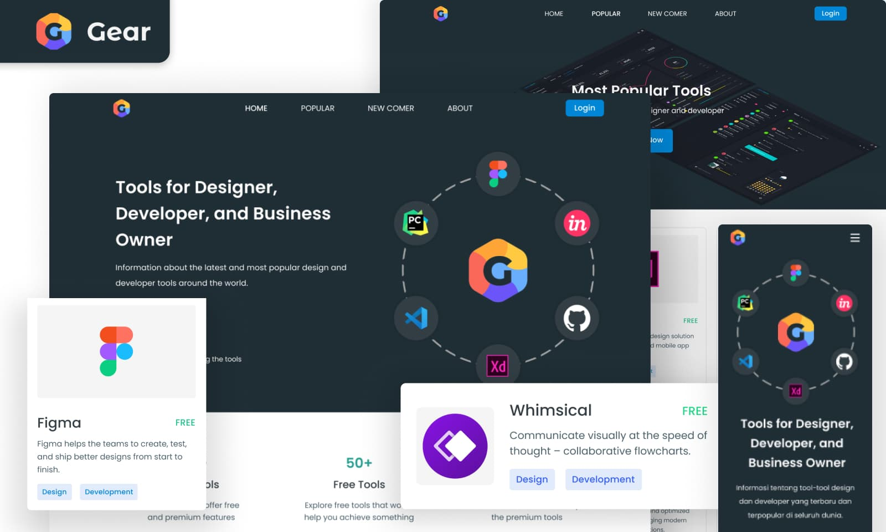

# Gear Tools

**[🇺🇦 Українською](README_uk.md)** | **English**

---

Catalog-style static website that curates popular and newcomer tools for
designers and developers. Built as a multipage, responsive experience with
lightweight vanilla JavaScript interactions and adaptive assets.

### Preview

### Links

- **Live Demo:** https://aleksandr-reznichenko.github.io/gear-tools/
- **Repository:** https://github.com/Aleksandr-Reznichenko/gear-tools

### Highlights

- Multipage: `index.html`, `popular-tools.html`, `newcomer-tools.html`,
  `about.html`.
- Responsive UI with shared `css/main.css` plus modular component/page styles.
- Adaptive images: `srcset` with `@2x` assets for retina/high-DPI displays
  across heroes, logos, tool cards, and team photos.
- Interactivity in vanilla JS: mobile menu with scroll lock, typed rotating
  headline, smooth anchor scrolling, current-page highlighting, scroll-aware
  back-to-top button.
- Animations via AOS (disabled below 1200px viewport to keep mobile and tablet
  devices performant).
- Accessibility touches: `aria` labels, `aria-current` on active links,
  keyboard-friendly buttons/links.

### Tech Stack

- HTML + CSS (BEM-like naming) + vanilla JavaScript.
- External CDNs: Modern Normalize, AOS; Google Fonts.

### Project Structure

- `index.html` — landing with hero, tool stats, popular preview, newcomer
  preview, testimonials, trusted brands, subscription footer.
- `popular-tools.html` — full catalog of popular tools with plan badges and
  tags.
- `newcomer-tools.html` — curated list of rising tools.
- `about.html` — mission statement, culture highlights, team roster.
- `css/` — base, layout, component, and page-level styles combined via
  `css/main.css`.
- `js/` — `mobile-menu.js`, `typed-headline.js`, `current-page.js`,
  `scroll-page.js`, `back-to-top.js`.
- `images/` — logos, icons, hero assets, team photos, sprites, favicons,
  including `@2x` variants.

### Run Locally

1. Clone or download the repo.
2. Open `index.html` in a browser, or serve the folder with any static server
   (e.g., VS Code Live Server).
3. Use the header navigation to browse other pages.

### Deployment

- Static-site ready for any host (e.g., GitHub Pages). Canonical links target
  the live demo: https://aleksandr-reznichenko.github.io/gear-tools/
